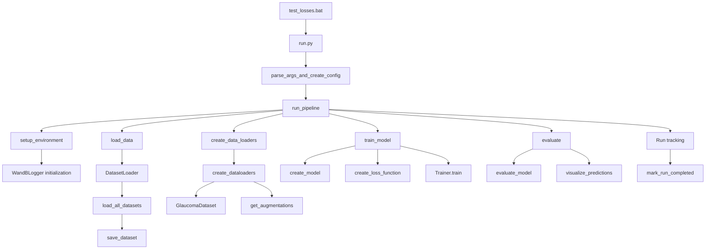

# Glaucoma Detection Pipeline Flow

## Overview

This document outlines the complete flow of the glaucoma detection pipeline, specifically focusing on the loss function comparison setup in `test_losses.bat`. The pipeline is designed for segmentation of optic disc and cup in retinal images to aid in glaucoma detection.

## Pipeline Flow

## 1. Batch File Execution (`test_losses.bat`)

The pipeline starts with `test_losses.bat`, which sets up key parameters and executes multiple runs with different loss functions:

- **Configuration Parameters**:
  - WandB Project: `glaucoma-detection`
  - WandB Group: `loss_comparison`
  - Device: `cuda`
  - Epochs: `20`
  - Batch Size: `16`
  - Architecture: `unet`
  - Encoder: `resnet34`

- **Loss Functions Tested**:
  - Binary Cross-Entropy (BCE)
  - Dice Loss
  - Focal Loss
  - Combined Loss

Each run is given a unique name in the format `{architecture}_{encoder}_{loss_function}`.

## 2. Config Creation and Pipeline Execution (`run.py`)

1. **Argument Parsing**: Command-line arguments from `test_losses.bat` are parsed using `get_argument_parser()`
2. **Configuration Creation**: `parse_args_and_create_config()` creates a complete `Config` object with all necessary settings
3. **Run Tracking**: Checks if the exact configuration has been run before using the `RunTracker` to avoid duplicate runs
4. **Pipeline Execution**: Calls `run_pipeline()` with the created configuration

## 3. Setup Environment

1. **Random Seeds**: Sets random seeds for reproducibility
2. **Device Selection**: Selects CPU or CUDA based on configuration
3. **Loss Weight Configuration**: Ensures loss weights are correctly set based on the selected loss function
4. **Directory Creation**: Creates output and checkpoint directories
5. **WandB Initialization**: Sets up Weights & Biases logging with appropriate project, group, and tags

## 4. Data Loading and Processing

1. **Dataset Loading**: `DatasetLoader` loads images and masks from configured dataset directories
2. **Data Splitting**: Data is split into training, validation, and test sets
3. **Augmentation Setup**: Configures data augmentations based on preprocessing settings
4. **DataLoader Creation**: Creates PyTorch DataLoaders with GlaucomaDataset for efficient data loading

## 5. Model Creation and Training

1. **Model Initialization**: Creates a segmentation model (UNet with ResNet34 encoder)
2. **Loss Function Setup**: Creates the specified loss function (BCE, Dice, Focal, or Combined)
3. **Optimizer Setup**: Creates the Adam optimizer with configured learning rate
4. **Training Loop**: Executes the training process with:
   - Batch processing
   - Forward/backward passes
   - Gradient updates
   - Validation
   - Checkpoint saving
   - Early stopping
   - WandB logging

## 6. Evaluation

1. **Test Set Evaluation**: Evaluates the model on the test set
2. **Metric Calculation**: Calculates key metrics:
   - Dice coefficient
   - IoU (Intersection over Union)
   - Accuracy
   - Precision
   - Recall
   - F1 score
3. **Visualization**: Generates visualizations of predictions
4. **WandB Logging**: Logs metrics and visualizations to Weights & Biases

## 7. Run Tracking

1. **Run Completion**: Marks the run as completed in the run tracker
2. **Results Storage**: Stores key metrics in the run tracker for later reference

## Loss Functions Implementation

### Loss Functions Module (`losses_module.py`)

The `losses_module.py` file implements all loss functions used for training:

1. **Dice Loss**: Measures overlap between predictions and targets
   - Signature: `1 - (2*intersection + smooth) / (sum(inputs) + sum(targets) + smooth)`
   - Good for class imbalance (common in segmentation)

2. **Focal Loss**: Focuses training on hard examples
   - Modifies BCE loss with factors to focus on misclassified examples
   - Parameters: `alpha` = 0.25 and `gamma` = 2.0 (control class balance and focusing strength)

3. **Binary Cross-Entropy**: Standard classification loss
   - Measures probability error in binary classification

4. **Combined Loss**: Weighted combination of loss functions
   - Allows mixing Dice, BCE, and Focal losses with configurable weights
   - Default configuration for "combined" loss uses both Dice and Focal loss

## Configuration Correctness

The implementation correctly configures:

1. **Loss Weights**: Each loss type (BCE, Dice, Focal, Combined) has appropriate weights set
2. **Optimizer**: Uses Adam optimizer with learning rate 0.001
3. **Learning Rate Scheduling**: Uses ReduceLROnPlateau with appropriate patience and factor
4. **WandB Integration**: All runs are properly logged with appropriate project, group, and tags

## Data Flow Verification

The pipeline correctly implements:

1. **Data Loading**: Images and masks are loaded correctly
2. **Augmentation**: Appropriate augmentations are applied only to training data
3. **Model Forward Pass**: Model generates logits of shape (B, 1, H, W)
4. **Loss Calculation**: Losses are applied correctly with sigmoid activation
5. **Backpropagation**: Gradient calculation and weight updates are performed correctly
6. **Evaluation**: Binary predictions use threshold 0.5 for segmentation

## Conclusion

The glaucoma detection pipeline, as configured in `test_losses.bat`, correctly implements a comprehensive loss function comparison experiment. Each component is properly implemented and integrated, ensuring that the experiment produces valid results. The WandB integration provides proper experiment tracking, and the run tracker ensures that experiments are not accidentally duplicated.